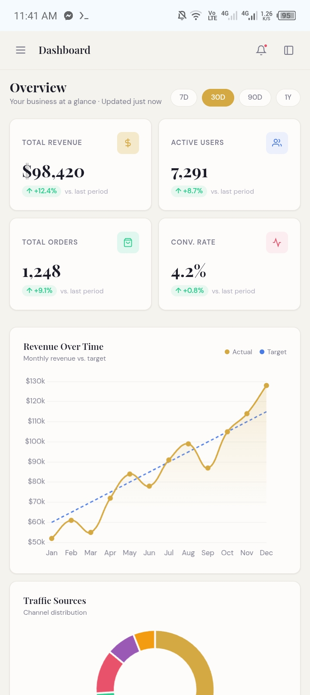

# InsightBoard

> A responsive analytics dashboard built with HTML5, CSS3, and Vanilla JS. Features KPI cards with skeleton loaders, interactive Chart.js visualizations, a sortable/paginated orders table, activity feed, and a collapsible sidebar — styled with a warm editorial palette and smooth animations.

---

## Preview



---

## Features

- **KPI Cards** — Revenue, Users, Orders, and Conversion Rate with trend indicators and skeleton loaders
- **Period Filters** — Toggle between 7D, 30D, 90D, and 1Y to update all metrics
- **Charts** — Line, doughnut, bar, and area charts powered by Chart.js
- **Orders Table** — Sortable columns, status filter dropdown, and 5-per-page pagination
- **Activity Feed** — Live system and user event log
- **Top Products** — Revenue-ranked product list with change indicators
- **Collapsible Sidebar** — Icon-only rail on desktop, slide-in drawer on mobile
- **Responsive** — Mobile-first layout, no horizontal scroll on any screen size
- **Accessible** — Semantic HTML, ARIA labels, keyboard navigation, high color contrast

---

## Tech Stack

| Layer      | Technology                  |
|------------|-----------------------------|
| Markup     | HTML5                       |
| Styles     | CSS3 (custom properties, grid, flexbox) |
| Logic      | Vanilla JS (ES6+)           |
| Charts     | Chart.js 4.4.1              |
| Fonts      | Playfair Display, DM Sans, DM Mono (Google Fonts) |

---

## Project Structure

```
src/
├── index.html          # Markup and layout
├── css/
│   └── main.css        # All styles (variables, components, responsive)
└── js/
    ├── dashboard.js    # Mock data, KPI rendering, table, feed, products
    ├── charts.js       # Chart.js chart definitions
    └── sidebar.js      # Sidebar toggle, mobile drawer, nav state
```

---

## Getting Started

No build tools or dependencies required. Just open the file in a browser.

```bash
git clone https://github.com/your-username/insightboard.git
cd insightboard/src
open index.html
```

Or serve it locally with any static server:

```bash
npx serve src
# then visit http://localhost:3000
```

---

## Customization

**Colors** — All design tokens are CSS custom properties in `main.css`:
```css
:root {
  --accent:      #D4A843;
  --bg:          #F5F3EE;
  --text-primary:#1C1C28;
  /* ... */
}
```

**Data** — All mock data lives in the `DATA` object at the top of `dashboard.js`. Swap it with a real API call to connect a live backend.

---

## License

MIT © 2026 InsightBoard
